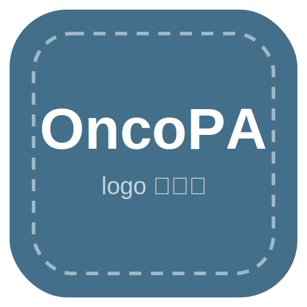

<div align="center">
  
  <h1>OncoPA</h1>
  <p>癌藥事審・送審準備 ── 協助個管師快速找對給付條文、複製、備齊送審資料</p>
</div>

---

## 簡介

**OncoPA**（Onco + Prior-Authorization）是彰濱秀傳癌症中心個管師使用的獨立工具。當醫師交代「幫某病人申請某抗癌藥（事前審查）」時，個管師依**癌別 → 藥 → 條文**逐步定位，找到這次要送的那一條給付規定，一鍵複製貼到送審單，並依條文自動列出要備齊的資料清單。

只收錄**需事前審查**的健保第 9 節抗癌瘤藥物。免疫檢查點抑制劑依子分型（如非小細胞／小細胞肺癌）拆解，並列出 P 事審碼／PD-L1 對照供核對。

## 開啟

直接用瀏覽器開啟 `index.html`，或啟動本地伺服器：

```bash
python -m http.server 8000
# 然後開啟 http://localhost:8000
```

通行碼：`Sela`

## 部署到 GitHub Pages

推送到 `main` 分支，於 repo 的 Settings → Pages 啟用即可。

## 資料更新

藥物資料來自母程式「健保癌症藥物速查系統」。NHI 條文更新時，先更新母程式，再把母程式 `index.html`（或其中 `const drugs` 陣列）交給 Claude 重生本工具。版本自成一軌，不對齊母程式。詳見 `CLAUDE.md` 第八節。

## 目錄結構

```
OncoPA/
├── index.html              工具本體（含內嵌藥物資料）
├── favicon/
│   ├── app-logo.png        OncoPA 正式 app logo（主視覺）
│   ├── favicon.* / *.png   app logo 點陣套組
│   ├── site.webmanifest
│   └── sela.svg            SELA 品牌歸屬（footer 角標用）
├── CLAUDE.md               工作上下文（給下次 Claude）
├── SELA-handoff.md         給 Kit Claude（升 Kit 用）
├── SELA-logo-prompt.md     app logo 生成 prompt（待生成正式 logo）
├── README.md               本檔
└── .gitignore
```

## 版本

V0.3.0（資料 115.5.22）

---

<div align="center">
  
  <p><sub>Made by <b>SELA</b> · V0.3.0</sub></p>
</div>
